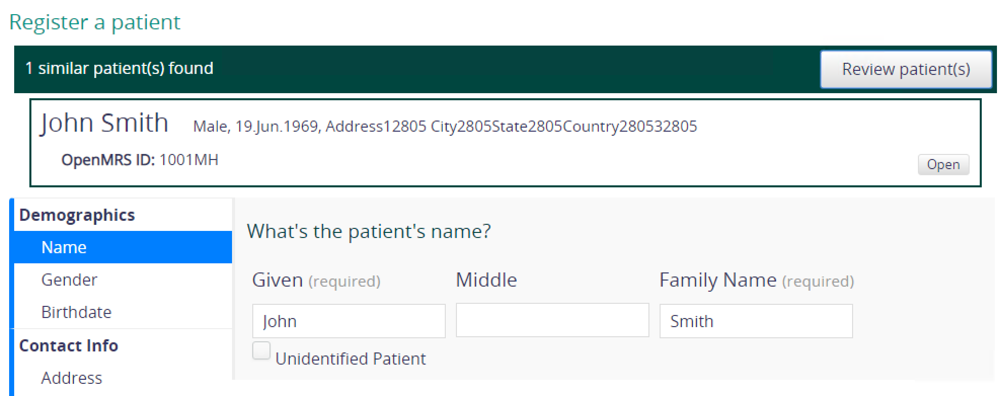
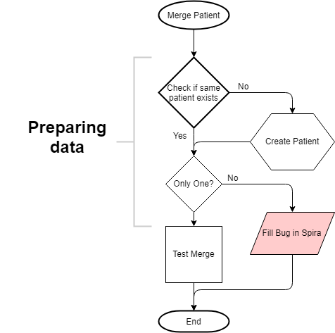
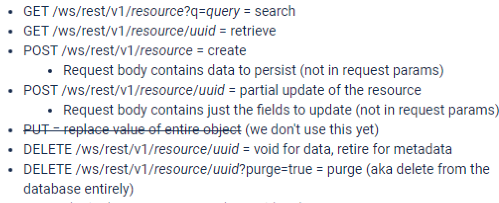
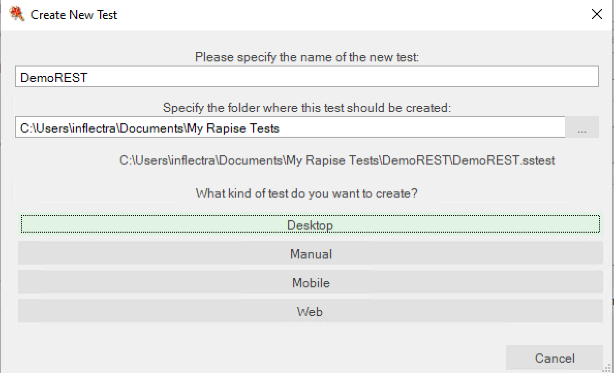
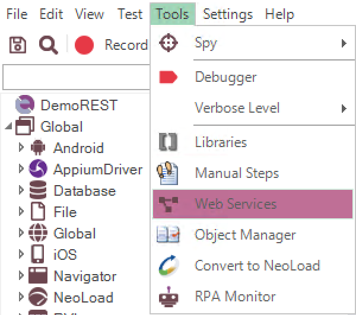
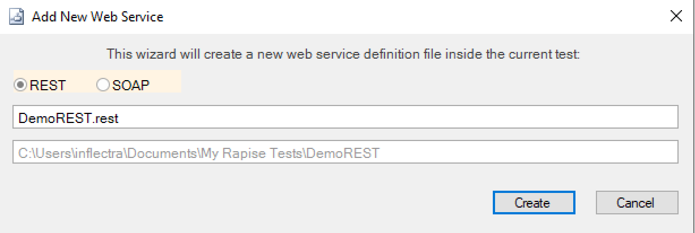
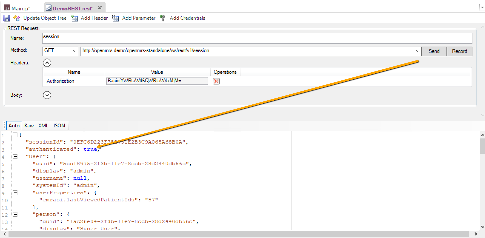
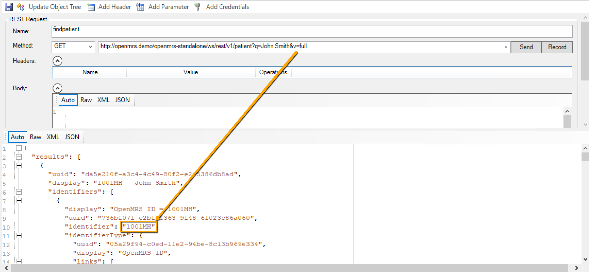
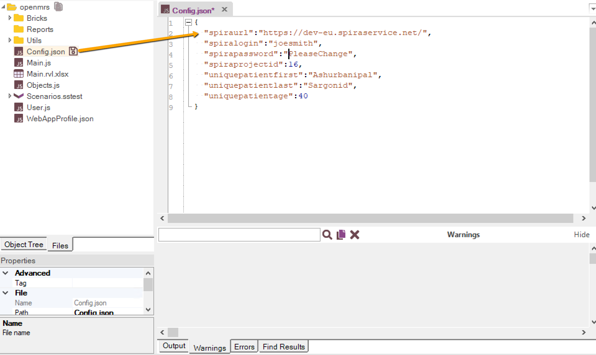

 [Download Now](https://inflectra.github.io/DownGit/#/home?url=https://github.com/Inflectra/rapise-framework-examples/tree/master/OpenMRS_API)

# Planet Test Automation: First Steps, Part 4: Automating REST/SOAP API Testing

Now we talk about API testing. Our plan is to touch both SOAP and REST endpoints in some real-life scenario.

We will use real system OpenMRS (https://www.openmrs.org/). One of its benefits for us (besides widespreaded use across the globe) is availability of accessible demo (https://www.openmrs.org/demo/) as well as one-click-to-install version that may be downloaded and launched locally.


    As you may noticed earlier we try to use 3rd party systems as applications under test (AUTs) rather than our own home-grown AUTs to make demonstration closer to real life. In the real life the application always have some problems and pitfalls challenging the automation engineer.

**OpenMRS** has REST api and we will utilize it.

It has no SOAP, but we will use another application with SOAP interface that will help make our testing better. It is [SpiraTeam](http://www.inflectra.com/SpiraTeam/). One of its features is Defect Tracking. So we plan to check consistency of data before running the test and, if there is a problem, create an incident in **SpiraTeam**. So QA person will see that something needs to be corrected before running automated tests again.

## Test Framework

We prepared a test framework to implement test set for **OpenMRS**. It is build in accordance with recommended framework design described [here](https://github.com/Inflectra/rapise-framework-examples/tree/master/SpiraFriendlyWithRvlAndUserLib).


We use sub-tests to separate logic. We also group sub-tests based on purpose:
 
* `Utils` - supplementary logic (to be used like callable functions). It is closer to block of code and tries to implement something with minimal chances to stop test execution. Utils may re-use each other.
* `Bricks` -  common building blocks for test scenarios.  In our case it is **Login** and **Logout**. This is very similar to `Utils`, but may contain some validations, so it may stop or break if some side-check is not succeeded). Bricks may use Utils and other bricks.
* `Scenarios` - actual test scenarios. May use Bricks, Utils and have own logic.

Initially we have 3 scenarios planned `TC01_Login` `TC02_CreatePatient` `TC03_CreateMergePatient`. But only one of them is currently implemented (TC03). Please, note that we didn't start from first (TC01). We had a planning stage and identified several scenarios worth implementing. Then we have chosen one of them. It is promising: it takes much time from manual tester while still easy to automate.

    It is common mistake to always start implementation of tests from first scenario and then move on. Always think what will bring you more benefits and save maximum time.

So here we implement `S03` first. Here we test the merge patient feature. When filling a new patient data in **OpenMRS** the system checks matching existing patient and advises to merge entries to avoid duplicates. It looks like that:



Our goal is to test this logic. So we plan to prepare patients DB to have single entry of a patient with specified name, to then register it again and validate the merge prompt:



The block in **Preparing Data** section uses REST API to ensure that patient with specific name exists once in the target system and gets its **OpenMRS ID** for further merge.

If two or more patients with same name already exist, we cannot launch the test. In this case we stop test execution and fill bug about inconsistent data in the database. We use SOAP API to automatically fill a bug in SpiraTeam.

## APIs

We plan to use 2 APIs here:

1. OpenMRS REST API to ensure to create patient and get his ID.
2. SpiraTeam SOAP API to create an incident if two or more patients were found.

### OpenMRS REST

#### REST: Analyze

First we **analyze** the API. For REST what we need first is to find entry point and some documentation. In most cases googling for something like '<appname> REST' helps. So it does in this time, here is what we get for 'openmrs REST':


And the first link brings us what we need:

https://wiki.openmrs.org/display/docs/REST+Web+Services+API+For+Clients

It is a long document. We may read it all, but usually I try to find something by word 'Authorization' or 'Authentication' on that page. This is my quick way to begin. Here is what we get:


And this paragraph brings us two pieces of useful information:

1. Authorization requires adding request header `Authorization: Basic <base64_of_usr:pwd>`.
2. REST entry point is <url>/openmrs/ws/rest/v1/session or <url>/ws/rest/v1/session . We don't know which of them is correct from the docs. So we going to quickly try both by checking url in the web browser:
   
   And we see that 1st URL returns 404 error, while 2nd:
   
   Returns some meaningful result. So we know that URL for us is:

   http://openmrs.demo/openmrs-standalone/ws/rest/v1/session

   This should help to work with other entry point URLs.

Also looking around the document we find a logic explaining REST API structure for other requests:



#### REST: Try

Now we are going to proceed to the **try** phase. It is an easiest way to finalize the **analyze** phase, because document does not specify what exact syntax and exact output for a particular API call. So we have to try it to figure it out ourself.

At this point we may start Rapise and create new test ("Desktop" test type is fine for this purpose, Web Services have own library that is automatically added when you add a service).



Now we need to create a web service using **Tools->Web Services**.



And create a REST one:



Now we have new request and going to fill (1) `name` and (2) `URL`


As follows:

(1) session

(2) http://openmrs.demo/openmrs-standalone/ws/rest/v1/session

Also we need to set authorization header and pass Base64-encoded `user:password` string as follows:


    You may find more information about filling request details and authentication data on the webinar recording for "Planet Test Automation: First StepsPart 4: Automating REST/SOAP API Testing" available on YouTube. This webinar contains live demonstration of the process described here.

Now we may **Send** this request and see that result is successful:



We now may proceed and try other requests.

Our master plan requires finding a patient. We may do it using an URL:

    http://openmrs.demo/openmrs-standalone/ws/rest/v1/patient?q=John Smith

The output contains found patients, but no patient ID as we see it in the system. So docs says we may switch it to return full output by supplying addition `v=full` param:



Also we may see that `patient` query returns an array:

```javascript
{
    "results: [ // <--- square brackets here mean 'array'
        ...
    ]
}
```

so we may see the number of found users with matching names from its length.

#### REST: Plan

The **Planning** phase requires us to define a sequence of actions we are going to get a patient. We keep trying new entry points while combining a required sequence of calls.

Now the tricky part is how to create a patient. So we need to try entry points related to this process and call API entry points one-by-one until we have everything to record the full scenario of ensuring that the only matching patient exists. The sequence of required actions is described in this document topic: https://wiki.openmrs.org/display/docs/Create+Patient. So we just need to try and add corresponding entry points to our REST service definition:

1. **findpatient**: `GET http://openmrs.demo/openmrs-standalone/ws/rest/v1/patient?q={PersonName}&v=full

2. **addperson**: `POST http://openmrs.demo/openmrs-standalone/ws/rest/v1/person` -- add a person to DB.

3. **patientidentifiertype**: `GET http://openmrs.demo/openmrs-standalone/ws/rest/v1/patientidentifiertype` -- to read type of 'OpenMRS ID' identifier. We may just find unique GUID and hard-code in the call to **patient**.

4. **location**: `GET http://openmrs.demo/openmrs-standalone/ws/rest/v1/location` location for **patient**.

5. **genidentifier**: `GET http://openmrs.demo/openmrs-standalone/module/idgen/generateIdentifier.form?source=1&username={login}&password={password}` -- generate identifier for **patient**.

6. **patient**: `POST http://openmrs.demo/openmrs-standalone/ws/rest/v1/patient` -- add new patient using personid, identifiertype, locationid and identifier value generated in previous steps.

#### REST: Implement

*The *Implementation** of REST test is recording of JS script and further post-processing by adding some parameters, data values and conditional statements.

For example, for 1st step we send request from the editor. After pressing **Send** you will see that button **Record** shows up. On pressing it we have request Body displayed as a tree as well as **Verify** button to verify the whole output:


And in the bottom we have 'REST Script Steps' panel with recorded step.

Now we may add read or verification. **Verify** button will not work as we want in this case because the response as a whole changes every time (sessionID is re-generated). But we may check that `authenticated=True` by using corresponding context menu:


And we get verification step recorded:


Then we proceed similar recording for other steps defined in the **planning** stage.

We will skip that steps except couple of points. 

Here is how we read number of found patients:


And here is how we get ID of the 1st patient:


We proceed recording using **Send**, **Record**, **Verify**/**Read** for all further steps and finally get these script steps:


And, after  pressing **Create Script**, we get this **JavaScript** code generated into the `Main.js`:
```javascript
	var OpenMRS_session=SeS('OpenMRS_session');
	OpenMRS_session.SetRequestHeaders([{"Name":"Content-Type","Value":"application/json"},{"Name":"Authorization","Value":"Basic YWRtaW46QWRtaW4xMjM="}]);
	OpenMRS_session.DoExecute();

	OpenMRS_session.DoVerify('OpenMRS_session Response', "authenticated", true);
	var OpenMRS_findpatient=SeS('OpenMRS_findpatient');
	OpenMRS_findpatient.SetRequestHeaders([{"Name":"Content-Type","Value":"application/json"}]);
	OpenMRS_findpatient.DoExecute();

	OpenMRS_findpatient.GetResponseBodyObject("results.length");
	var OpenMRS_location=SeS('OpenMRS_location');
	OpenMRS_location.SetRequestHeaders([{"Name":"Content-Type","Value":"application/json"}]);
	OpenMRS_location.DoExecute();

	OpenMRS_location.GetResponseBodyObject("results[6].uuid");
	var OpenMRS_patientidentifiertype=SeS('OpenMRS_patientidentifiertype');
	OpenMRS_patientidentifiertype.SetRequestHeaders([{"Name":"Content-Type","Value":"application/json"}]);
	OpenMRS_patientidentifiertype.DoExecute();

	OpenMRS_patientidentifiertype.GetResponseBodyObject("results[0].uuid");
	var OpenMRS_genidentifier=SeS('OpenMRS_genidentifier');
	OpenMRS_genidentifier.SetRequestHeaders([{"Name":"Content-Type","Value":"application/json"}]);
	OpenMRS_genidentifier.DoExecute();

	OpenMRS_genidentifier.GetResponseBodyObject("identifiers[0]");
	var OpenMRS_patient=SeS('OpenMRS_patient');
	OpenMRS_patient.SetRequestHeaders([{"Name":"Content-Type","Value":"application/json"}]);
	OpenMRS_patient.DoExecute();

	OpenMRS_patient.GetResponseBodyObject("uuid");
```

We are going to make some modifications to this script to get the final version:

1. Remove `SetRequestHeader` for each step and use `Session.SetRequestHeader(...)` once before all steps.
2. Explicitly provide POST data to some calls using `OpenMRS_<action>.SetRequestBodyObject`.
3. Use `Base64.encode` to prepare Authorization string using a function that we took from here: http://www.webtoolkit.info/javascript-base64.html#.XepUMpMzb6o and put into `User.js`.
4. Use variables to store intermediates and return values `OpenMRS_location.GetResponseBodyObject(...)`.
5. Use `Global.SetProperty` to save acquired Patient ID for re-use in other tests.
6. If more than one patient already found, call another sub-test (LogSpiraIncident) defined in the same test framework.


Finally we get a sequence looking like that:

```javascript
var enc = Base64.encode('admin:Admin123');
Tester.Message(enc);

var firstName = params.firstName || Global.GetProperty('uniquepatientfirst');
var lastName = params.lastName || Global.GetProperty('uniquepatientlast');
var age = params.age || Global.GetProperty('uniquepatientage');

Session.SetRequestHeader({"Name":"Content-Type","Value":"application/json"});

var OpenMRS_session=SeS('OpenMRS_session');
OpenMRS_session.SetRequestHeaders(
    [
        {"Name":"Authorization","Value":"Basic "+enc}
    ]
);
OpenMRS_session.DoExecute();


var OpenMRS_findpatient=SeS('OpenMRS_findpatient');
OpenMRS_findpatient.SetParameters('PersonName', firstName+' '+lastName);
OpenMRS_findpatient.DoExecute();

var foundPatients = OpenMRS_findpatient.GetResponseBodyObject("results.length");

if(foundPatients==0)
{
    var OpenMRS_addperson=SeS('OpenMRS_addperson');
    OpenMRS_addperson.SetRequestBodyObject(
    {
        "names": [
        {
            "givenName": firstName,
            "familyName": lastName
        }
        ],
        "gender": "M",
        "age": age
    }
    )
    OpenMRS_addperson.DoExecute();
    var personId = OpenMRS_addperson.GetResponseBodyObject("uuid")
    
    var OpenMRS_patientidentifiertype=SeS('OpenMRS_patientidentifiertype');
    OpenMRS_patientidentifiertype.DoExecute();
    var patiendOpenId = OpenMRS_patientidentifiertype.GetResponseBodyObject("results[0].uuid");
    
    var OpenMRS_location=SeS('OpenMRS_location');
    OpenMRS_location.DoExecute();
    var locationId = OpenMRS_location.GetResponseBodyObject("results[6].uuid");
    
    var OpenMRS_genidentifier=SeS('OpenMRS_genidentifier');
    OpenMRS_genidentifier.DoExecute();
    var patientOpenId = OpenMRS_genidentifier.GetResponseBodyObject("identifiers[0]");

    var OpenMRS_patient=SeS('OpenMRS_patient');
    
    OpenMRS_patient.SetRequestBodyObject(
        {
            "identifiers": [
            {
                "identifier": patientOpenId,
                "identifierType": "05a29f94-c0ed-11e2-94be-8c13b969e334",
                "location": locationId,
                "preferred": true
            }
            ],
            "person": personId
        }
    );
    OpenMRS_patient.DoExecute();

    var patientId = OpenMRS_patient.GetResponseBodyObject("uuid");
    
    Global.SetProperty('MergePatientId', patientOpenId);

} else if(foundPatients==1) {
    Tester.Assert('Exactly one person found, ready for merge test', true);
    var patientOpenId = OpenMRS_findpatient.GetResponseBodyObject("results[0].identifiers[0].identifier");
    Global.SetProperty('MergePatientId', patientOpenId);

} else {
    var incInfo = 'More than one patients already exist: '+ firstName+' '+lastName;
    var incData = JSON.stringify(OpenMRS_findpatient.GetResponseBodyObject("results"), null, '\t')
    
    Global.DoInvokeTest('%WORKDIR%/LogSpiraIncident/LogSpiraIncident.sstest',
        {
            name: incInfo,
            description: 'Found users:<br/><pre>'+ incData+"</pre>"
        }
    );
    
    Tester.Assert(incInfo, false, incData);

}

```

### OpenMRS SOAP

The second part of our master plan is to write an incident into SpiraTeam. And we are planning to use SOAP API for that. And sequence of our activities is still the same: **Analyze**, **Try**, **Plan**, **Implement**.

#### SOAP: Analyze

The goal of the SOAP analysis is to find WSDL, entry point and documentation. Once we have it, we have all keys to start.

For the Spira the APIs are described at [http://api.inflectra.com](http://api.inflectra.com)

Here we quickly find a reference to existing methods:

**Protocol**|**Documentation**|**Service URL**
:-----:|:-----:|:-----:
Version 6.0| | 
REST|/Services/v6\_0/RestService.aspx|/Services/v6\_0/RestService.svc
SOAP|/Services/v6\_0/SoapService.aspx|/Services/v6\_0/SoapService.svc
Version 5.0| | 
REST|/Services/v5\_0/RestService.aspx|/Services/v5\_0/RestService.svc
SOAP|/Services/v5\_0/SoapService.aspx|/Services/v5\_0/SoapService.svc
Version 4.0| | 
REST|/Services/v4\_0/RestService.aspx|/Services/v4\_0/RestService.svc
SOAP|/Services/v4\_0/ImportExport.aspx|/Services/v4\_0/ImportExport.svc
 | |/Services/v4\_0/DataSync.svc
Version 3.0| | 
SOAP|/Services/v3\_0/ImportExport.aspx|/Services/v3\_0/ImportExport.svc
 | |/Services/v3\_0/DataSync.svc
Version 2.2| | 
SOAP|/Services/v2\_2/ImportExport.asmx|/Services/v2\_2/ImportExport.asmx
Version 1.5| | 
SOAP|/Services/v1\_5\_2/Import.asmx|/Services/v1\_5\_2/Import.asmx
Version 1.2| | 
SOAP|/Services/v1\_2\_0/TestExecute.asmx|/Services/v1\_2\_0/TestExecute.asmx

Now we can see that Spira maintains long API version history. The question is what version to use?

In this framework we take a version with simpler API for accomplishing our need. I.e. we simply go to the service definition and find the method to create an incident in different API versions. Then we pick up one that is more convenient for us.

We can quickly find method for creating an incident: `Incident_Create` and compare the API between versions.

For the current latest version v6 it is:


While for previous version v5 it was:


Here we can see that it v5 there was less parameters and argument `credentials` is a structure with 6 fields. And we may avoid filling it by choosing v5. This is not the only reason for choosing version, but one of them.

So we decide to proceed with v5.

The table above has URL entry points, so we may make entry point for our instance. Our demo URL is https://dev-eu.spiraservice.net/ and our postfix is, according to the table, `/Services/v5_0/SoapService.svc`. So we combine them and get the SOAP API entry point. We just try it in the browser to see if there anything listening there. And there is a service:


Now we can proceed to analysis by just trying.

#### SOAP: Try

Here we also create a test, and choose **JavaScript** as a language. 

Now we do **Tools->Web Services** and add a **SOAP** definition file. Then we use our URL and do **Get WSDL** to get available methods:


So we may now simply try to create an incident. I know that I need to do some authorization, but I may do in back way: try what I need, see what errors I get and do what I'm asked to until I have the whole sequence. Rapise SOAP editors remembers last input params, so we may switch between methods and try different combinations to make sure we get the the sequence and the values that are needed.

Se we quickly fill two most essential fields: `Name` and `Description` and press **Invoke**:


We can see an expected error. Luckily error contains valuable information on what we needs to do. So we are going to try `Connection_Authenticate`, fill login information and see:


Connection successful. Now go back to `Incident_Create` and invoke it again:


We still get an error, but with next hint. We need `Connection_ConnectToProject`. This one is simple, we just need to specify project id, and:


... and it fails. Because we need to also set `projectIdSpecified=true`. Otherwise `projectId` parameter value is ignored. So we fix it and now connect successfully:


Now we may go and make sure that `Incident_Create` is successful by just invoking it again. This time it is.

#### SOAP: Plan

Well, we are ready to do recording. Here is the sequence we figured out from the **try** phase:

1. `Connection_Authenticate`
2. `Connection_ConnectToProject`
3. `Incident_Create`
4. `Connection_Disconnect` -- it is not required, but once it is here and has no params, it is good to use it.

#### SOAP: Implement

Let's record a sequence in a way similar to REST section, using **Invoke**&**Record**/**Verify** buttons:

So we get the following sequence of script steps:


So **Create Script** produces the following **JavaScript**:

```javascript
	var DemoSOAP=SeS('DemoSOAP');
	DemoSOAP.DoExecute('Connection_Authenticate', {"userName":"joesmith","password":"PleaseChange"});
	DemoSOAP.DoExecute('Connection_ConnectToProject', {"projectId":16,"projectIdSpecified":true});
	DemoSOAP.DoExecute('Incident_Create', {"remoteIncident":{"ComponentIds":[],"Description":"Auto Incident","DetectedReleaseVersionNumber":"","FixedBuildName":"","IncidentStatusName":"","IncidentTypeName":"","Name":"Auto Incident","OpenerName":"","OwnerName":"","PriorityName":"","ProjectName":"","ResolvedReleaseVersionNumber":"","SeverityName":"","TestRunStepIds":[],"VerifiedReleaseVersionNumber":"","CustomProperties":[]}});
	DemoSOAP.DoExecute('Connection_Disconnect', {});
```

The only change worth doing. We may remove redundant parameters from `Incident_Create` call:

```javascript
	DemoSOAP.DoExecute('Incident_Create', {"remoteIncident":{"Description":"Auto Incident","Name":"Auto Incident"});
```

Which may be parameterized using variables in some places such as here with `name` and `description` variables:

```javascript
	DemoSOAP.DoExecute('Incident_Create', {"remoteIncident":{"Description":description,"Name":name});
```

## Using Test Framework

You may use this demo test, by meeting the following pre-requisites:

1. You need [Rapise](https://www.inflectra.com/Rapise/?utm_source=GoogleAd&gclid=EAIaIQobChMI44z91oOp5gIVyLYYCh2x1gHdEAAYASAAEgL2hfD_BwE) 6.3 or higher.
2. You need to download, unpack and start https://sourceforge.net/projects/openmrs/files/releases/OpenMRS_Reference_Application_2.9.0/referenceapplication-standalone-2.9.0.zip/download a reference application. This package contains everything, so if you have **Java** installed it will get up and running with demo data after clicking `openmrs-standalone.jar`. The it works with user *admin* and password *Admin123*.
3. You need to change port to 80


4. In this test we access the demo using url `http://openmrs.demo`, so we need to define it by opening the file `c:\Windows\System32\Drivers\etc\hosts` in the editor with administrator permissions and adding a line:

    ```
    127.0.0.1   openmrs.demo
    ```

1. Change SpiraTeam credentials in `Config.xlsx`. This will define values returned by `Global.GetProperty` across all tests in the framework. We set path to `Config.xlsx` in the root `User.js` file inside `TestPrepare` function.

