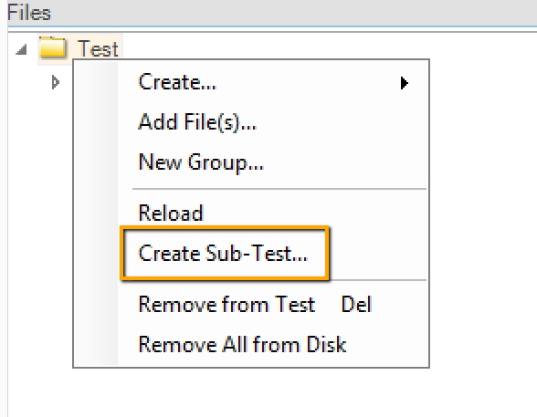
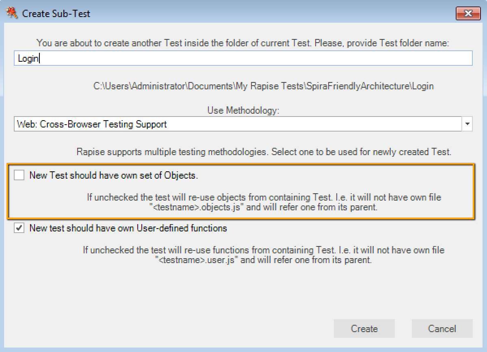
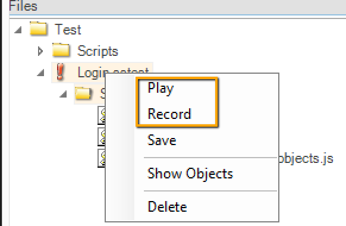
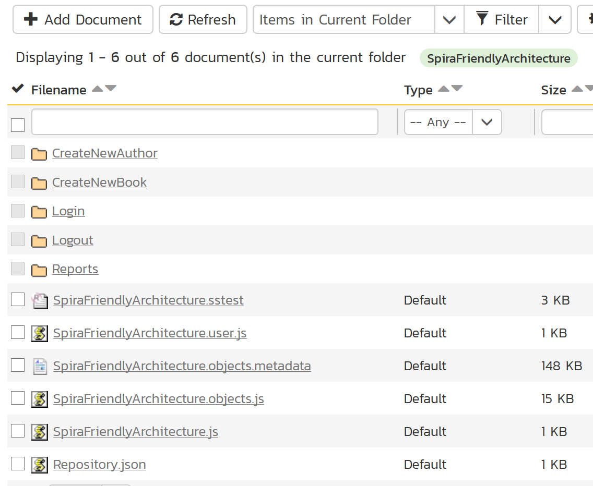
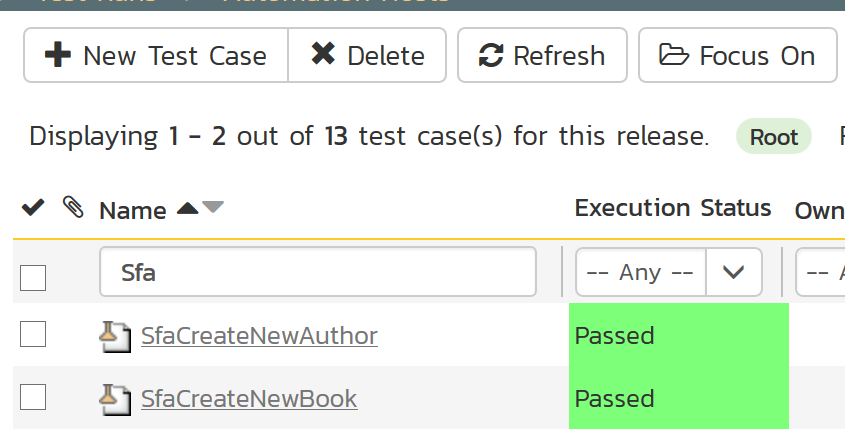
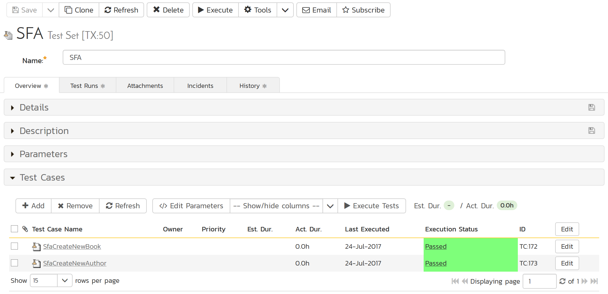

## SpiraFriendlyArchitecture

In this example we describe an approach to building of a test framework which is friendly to SpiraTeam.

### Create Root Test

First create the root test. It will contain sub-tests implementing both shared pieces and test cases.

In our example root test is `SpiraFriendlyArchitecture`.

### Create Sub-Tests for Shared Functionality

Then create sub-tests implementing parts for reuse in test cases. 



When creating a sub-test choose to share objects file with the root test and have own user file.



The example contains two such sub-tests: `Login` and `Logout`.

### Create Sub-Tests for Test Cases

Then create sub-tests implementing test scenarios. Do this same way as described in the previous section.

The example has sub-tests for `CreateNewBook` and `CreateNewAuthor` test cases.

Let's look at `CreateNewBook` test.

```javascript
function Test()
{
    Global.DoInvokeTest('%WORKDIR%/Login/Login.sstest');
    
    SeS('Book_Management').DoClick();
    SeS('_Create_new_book_').DoClick();
    SeS('Name_').DoSetText("David Copperfield");
    SeS('Author_').DoSelect("Charles Dickens");
    SeS('Genre_').DoSelect("Murder & Mystery");
    SeS('ctl00$MainContent$btnSubmit').DoClick();
    Tester.AssertEqual("Verify that: InnerText=David Copperfield", SeS('David_Copperfield').GetInnerText(), "David Copperfield");

    Global.DoInvokeTest('%WORKDIR%/Logout/Logout.sstest');
}
```

It calls `Login` and `Logout` shared tests and performs necessary actions to create a new book in the library system. Btw, the web site that we are testing is publicly available at [http://libraryinformationsystem.org](http://libraryinformationsystem.org)

To perform recording or playback for a particular sub-test use popup menu on the corresponding node in the file tree.



### Save Root Test to Spira

It's time to save our test framework into Spira. Do this for the root test first and let Rapise save the whole file tree with the root test and all sub-tests. The main purpose of this step is to create a repository and save files into Spira.



### Link Test Scenarios to Test Cases

Final step is to associate each test scenario with a test case in Spira. We have two such scenarios: `CreateNewBook` and `CreateNewAuthor`.

Open `CreateNewBook` test in Rapise and then choose `Save to Spira` on the ribbon. Link the test to a test case. Repeat for all other test scenarios.

**Note**: Rapise will use same repository that we created for the root test. So when a test scenario is to be executed by `Rapise Launcher` it will be downloaded from Spira together will all dependencies. Actually the whole file tree of the root test will be downloaded.



To run test cases in batch create a test set.



