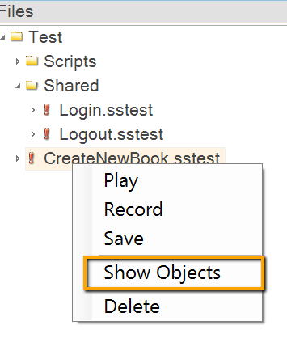

## WebSite1

This is actually same as `SpiraFriendlyArchitecture` but each test contains it's own set of objects. This approach may be useful when more than one tester works on test recording and updates the object tree. This is to avoid merging of changes made by different people to the same `*.objects.js` file.

To make objects of a particular test visible in the `Objects Tree` right click on a test node and select `Show Objects`.

