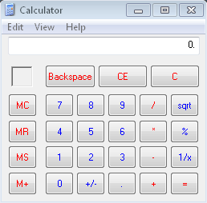
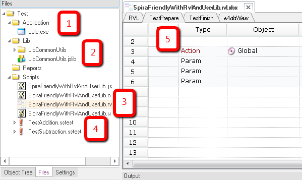
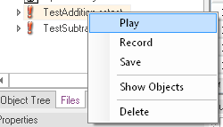
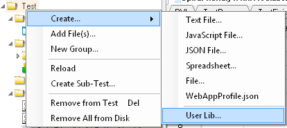
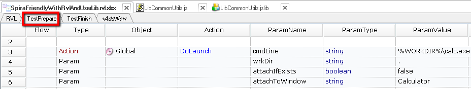
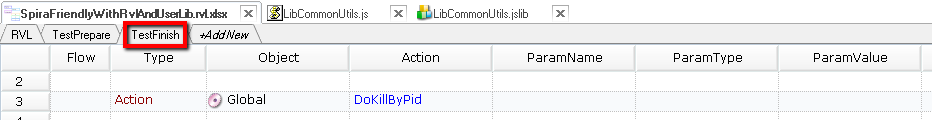
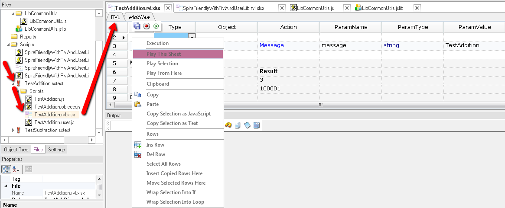

# Sample Spira-Friendly Framework with Multiple RVLs and Common Library

This framework uses several concepts of [Rapise](http://www.inflectra.com/Rapise/) intended to simplify framework development and design.

If you follow  the suggested design then you should get the following benefits:

* Common functionality shared among all tests in the framework.
* Easy sharing objects between sub-tests.
* `TestPrepare` tab for operations performed before any of the tests is executed.
* `TestFinish` tab for functionality finalizing each of the tests.
* Ability to work with each sub-test separately.
* Easy way to execute any piece of any RVL.


Let's elaborate these features one-by-one. But first, let's describe and Application Under Test and Test Framework design.

## Application and Test Framework

Our AUT is a trivial Calculator application.



Our goal is to implement the data driven testing framework and have these features: 
1. Primary goal is to have tests for Addition and Subtraction. 
2. Framework should be flexible. Later it should be easy to add more tests for other operations (multiplication, division, square root).
3. The test set should be locale-neutral. Calculator displays output in locale-specific manner (so, depending on it the result of `9999+1` may be printed as `10000`, `10 000`, `10 000.0`, `10 000,0`, `10.000,0`). We need a function that reads the result of calculation (`GetCalcResult`). This function should be accessible from any test.
4. Each test case should be able to start the AUT and then close it. However, if AUT is running, it should attach to existing instance. The logic for launching and closing an AUT should be in the RVL.
5. We need to be able to execute whole test set, separate test case or just few rows form any RVL. 

## Test Framework Structure
Let's see how master test file structure looks in Rapise:


1. It contains an AUT link. So you may call a calculator by double-clicking on it.

2. It contains a library "CommonUtils". The library is automatically loaded when test or any of the sub-tests are executed. The library also enables common functions, objects and triggers (`TestPrepare`/`TestFinish`)

3. Framework code itself. There are number of uses for this code. In our case it is an RVL script that:

   + Runs sub-tests one-by-one. You may use it to execute whole test set directly. 

   + Defines `TestPrepare` and `TestFinish` logic to launch a calculator and to close it afterwards.

4. Sub-Tests are referenced form the parent test. 

   + So double-click would open the sub-test. 

   + We may drag&drop them into main RVL script to insert execution logic.

   + Another option is to quickly execute specific sub-test using context menu:

     

5. There are 3 tabs in the root test for the following purposes:

   + `RVL`: The place where we execute sub-tests one-by-one. It is useful for development. You may want to quickly luch an array of tests instead of scheduling full execution using Spira.

   + `TestPrepare`: In this sample, it is called by the CommonUtils library before execution and launches Calculator instance (or attaches to existing one).

   + `TestFinish`: Close calculator in the end, called from CommonUtils library.


### Common Functionality 
We added a test framework library. The library is created using context menu in the Test Files tree:



By default the library has just two files: 
* `<libname>.jslib` -- defines features of the library (load behavior, load order, name, etc)
* `<libname>.js` -- the logic (test initialization, common variables, common functions and so on). 

In our case the `.jslib` file has the following contents:
````javascript
SeSRegisterLibrary(
	{
		name: 'CommonUtils',
		description: 'CommonUtils - Default user-defined library',
		include: 'Lib/LibCommonUtils/LibCommonUtils.js',
		info: null,
		load_order: 1000,   
		recording: false, // Only use in playback. If it has recording rules then set it to 'true'
		autoload: true // Always load this library for this test and each subtest
	}
);
````


1. It auto-loads for playback, `autoload` is `true`.
2. It is not loaded for recording, because `recording` is `false`.
3. It is loaded last (after all other library), because `load_order` is 1000 (very high).

### Function Sharing
Common functions are defined in `LibCommonUtils.js`.

First function shared between all test cases is `EnterNumber`. It types required input value into the `Text` field.

Another common function is `GetCalcResult`. Its purpose is to read result from the calculator `Text` field and trim all special characters to make same formatting on all locales:

````javascript
function EnterNumber(/**string*/strNumber)
{
	var inputField = SeS('Text');
	// Click to set focus for sure
	inputField._DoClick();
	// Now type the number
	Global.DoSendKeys(strNumber);
}

function GetCalcResult()
{
	/**
		Calculator formats result value in accordance with system formatting
		settings.
	*/
	var actual = SeS('Text').GetText();
	actual = Global.DoTrim(actual, true, "\xA0 ,");
	
	return actual;
}
````

Each function depends on the `Text` object, so this object should be available in each of the sub-tests, see next section for more info on object sharing. 

### Object Sharing
In this framework there are both common objects and test specific objects. I.e.:

Common objects defined in the root test:
* `Text` object used for typing input and reading results.
* `Equals` button used to execute a calculation operation.

Object defined in `TestSubtraction`:
* `Minus`

Object defined in `TestAddition`:
* `Plus`

The library contains code for loading common objects:

````javascript
function TestPrepare()
{
	Global.DoLoadObjects('%WORKDIR%/SpiraFriendlyWithRvlAndUserLib.objects.js');

  ...
}
````

This should be done using the `Global.DoLoadObjects` function and right place for it a function `TestPrepare`. It is called after all libraries are initialized but before the test is executed so it is a right place for objects loading.

## RVL Tabs for TestPrepare, TestFinish
It is convenient to define common logic in RVL. We add some code to `LibCommonUtils.js` for it.

So  we call this sheet:



In the beginning of test execution:

````javascript
function TestPrepare()
{
  ...
	RVL.DoPlaySpecial('%WORKDIR%/SpiraFriendlyWithRvlAndUserLib.rvl.xlsx', "TestPrepare");
  ...
}
````


And in the end of the test execution:

````javascript
function TestFinish()
{
	RVL.DoPlaySpecial('%WORKDIR%/SpiraFriendlyWithRvlAndUserLib.rvl.xlsx', "TestFinish");
}

````

Call this one:


These sheets are defined in the RVL of the framework root test. However they are executed when you run any of the test cases.

## Separate Test Cases

This approach with `TestPrepare`/`TestFinish` allows execution of each of the sub-tests separately. In any case execution will launch a Calculator and finally will close it. 

Also any test may use common functions (`EnterNumber` and `GetCalcResult`). 

## Executing Pieces
We load objects from each of the sub-tests in `TestPrepare`. 

````javascript
function TestPrepare()
{
  ...
	Global.DoLoadObjects('%WORKDIR%/TestAddition/TestAddition.objects.js');
	Global.DoLoadObjects('%WORKDIR%/TestSubtraction/TestSubtraction.objects.js');
  ...
}
````

The purpose of this approach is that any of RVL sheets may be executed directly from the root test. So 'Play this Sheet', 'Play from Here' and 'Play Selection' may be used directly:




